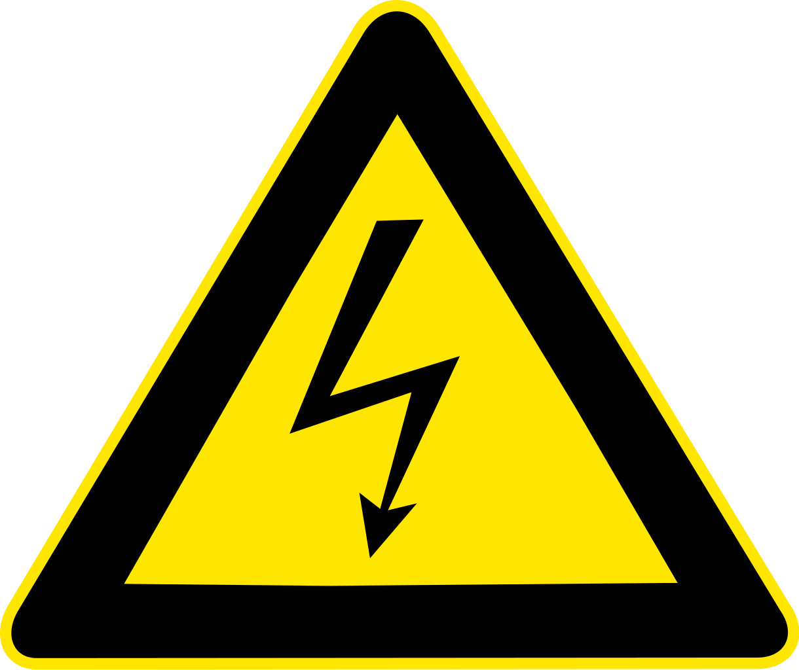

Registration Policies
---------------------

Students of all university levels are invited to compete. Each team must have a **team leader** and up to 3 additional team members (a total of 4 participants per team). Each team leader is responsible for coordinating with other members of their team and will be the point of contact for the entire team. Each team must also have a university **faculty advisor**.

The team leaders need to register their team members and faculty advisor electronically at https://hotcrp.engineering.nyu.edu/, using their team name as the 'Submission Title'. ESC uses a HotCRP-based registration and submission system for both the qualification and final rounds, and teams **must register before finalizing their report and computer file submissions** by the posted deadlines. In addition, CSAW requires all participating individuals (i.e., each team member separately) to complete a **questionnaire** available at http://tinyurl.com/csaw-esc-18-questionnaire.

Each team is eligible to register for **only one region** based on university affiliation: Europe, India, MENA, or US-Canada, as defined below. While team members do not need to attend the same university, all team members must be a part of the same region. 

-   **Europe:** Hosting students from universities located in the European Union, Switzerland, Norway, or Armenia
-   **India:** Hosting students from universities located in India
-   **MENA:** Hosting students from universities located in Algeria, Azerbaijan, Bahrain, Chad, Djibouti, Egypt, Eritrea, Georgia, Jordan, Iraq, Iran, Kuwait, Lebanon, Libya, Mauritania, Morocco, Oman, Pakistan, Palestine, Qatar, Saudi Arabia, South Sudan, Sudan, Syria, Tunisia, Turkey, United Arab Emirates, or Yemen. 
-   **US-Canada**: Hosting students from universities located within the United States or Canada

To be able to qualify to the final round, each team must register for the correct region based on the university affiliations of its members. 

After the registration closes, making changes to the existing members of a team (e.g., replacing a team member) or adding new team members, requires explicit permission from the organizers. This is also necessary for teams replacing team members or adding new team members during the final round of the competition.

Final Round Logistics
---------------------

Participation in CSAW Finals is contingent upon competitors' ability to enter the given country where CSAW is being hosted. **Each region has different team sponsorship, prize policies, and travel awards for the Final Round competition.** Please visit https://csaw.engineering.nyu.edu/esc/prizes for more details. 

Each CSAW region will announce separate winners for the first, second and third place.

Competition Deadlines
---------------------

-   Registration with [HotCRP system](https://hotcrp.engineering.nyu.edu/) and [questionnaire submission](http://tinyurl.com/csaw-esc-18-questionnaire) deadline: **September 3, 2018**. 

-   Qualification reports due in [HotCRP](https://hotcrp.engineering.nyu.edu/): **September 10, 2018**.

-   Announcement of teams qualified to the final phase: **September 17, 2018**.

-   Final reports and associated computer files due in [HotCRP](https://hotcrp.engineering.nyu.edu/): **November 1, 2018 5pm EST (UTC-5)**.

Code of Conduct
---------------

All ESC participants in all regions are subject to the NYU Tandon School of Engineering [student code of conduct](http://engineering.nyu.edu/life/student-affairs/code-of-conduct). Any act of academic dishonesty, including but not limited to: plagiarism, cheating, fabrication, unauthorized collaboration across different teams, work duplication, **will not be tolerated and the offenders will be automatically disqualified from the competition**.

Equipment Requirements
----------------------

For the live finals of the competition in each region, the teams will be asked to demonstrate their side-channel data leakage technique(s) on IoT smart light bulbs (tentatively the **Magic Blue Bluetooth Bulb**), which will be provided to the finalists by the organizers. Teams are responsible for acquiring and transporting any other equipment their techniques require.

Deliverables
------------

For the qualification phase, each participating team must upload **a written report** to the [HotCRP system](https://hotcrp.engineering.nyu.edu/) in PDF file format following the standard IEEE conference format (10pt font, double column, letter size paper, not compsoc mode); templates are available [here](http://www.ieee.org/conferences_events/conferences/publishing/templates.html) (LaTeX template is preferred). The qualification phase PDF report can be **up to 4 pages**, including references and appendices.

For the final phase, each qualified team must upload a **final PDF report** to the HotCRP system, along with a TAR.GZ file that includes all associated computer files and documentation for the implemented attacks. Final reports should follow the format of technical **blog posts**, including step-by-step instructions, findings, and any relevant documentation of all the approaches/techniques and attacks that will be demonstrated during the finals. Information pertaining to any assumptions the contestants make, thorough technical discussion, and points that address all the [grading criteria](README.md#grading) must be included in the blog post reports, in a **structured manner**. We encourage contestants to also include failed attempts and how/why they were unsuccessful, in addition to their successful approaches and attempts. There are no page limitations on the final reports, and we encourage teams to submit media-rich reports. In addition to the final reports, each team is asked to prepare a **PowerPoint presentation** (up to 10 slides) and a **short video** (2 to 4 minutes) demonstrating their work, to be presented on the day of the live finals at CSAW events.

**_We stress that final reports must be submitted in PDF format, and that blog posts MUST NOT be published or otherwise made publicly available before announcement of ALL winners in ALL global CSAW ESC regions._**

Contact Information
-------------------

Teams can contact their regional organizers at the following email address: csaw-esc@nyu.edu. To properly route each message and avoid delays in the response, each message must prepend the tag `[US-Canada]`, `[Europe]`, `[MENA]`, or `[India]` in the subject line, depending on the region of the participating team.

Responsible Disclosure
----------------------

In the event that ESC18 contestants find critical, previously undisclosed vulnerabilities in the smart light bulbs during the competition's final phase, we ask that they contact CSAW ESC18 organizers so we can assist and jointly coordinate responsible disclosure procedures, if any such procedures are deemed necessary.

Safety
------

For the final phase, teams are required to be extremely careful and take all necessary safety precautions when handling devices, as they operate with electricity. By participating in the competition, teams agree that CSAW and ESC organizers shall not be held responsible or liable for any potential losses or damages.